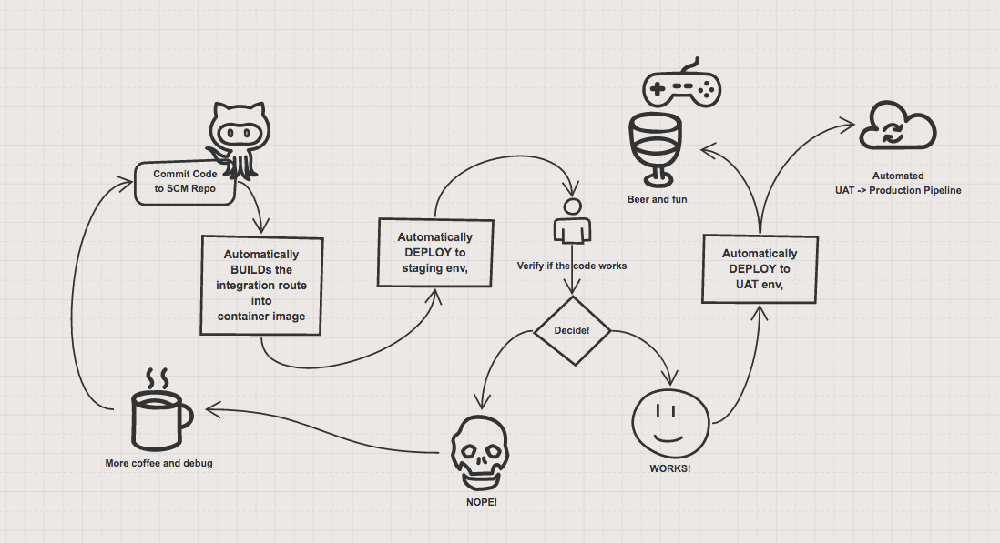

# FIS 2.0 Financial Demo

This Financial demo is a simple gateway that redirect the incoming request of 
 - Checking balance
 - Transfer money 
to different money source, one pass to a traditional banking microservice app, which interact directly with MySQL database, and pass the bitcoin request to the other microservice application connecting to a mock-blockchain through messaging broker. 


There are many aspect with this demo, 
1. Source to Image (S2i) build and deploy process
2. Building a pipeline to support automated CI/CD
3. Exposing RESTAPI using Camel, and export API doc to swagger

but first, let's start with setting up the application. 

## Setting up OpenShift 
[Install OpenShift Container Platform 3.3] (https://github.com/redhatdemocentral/ocp-install-demo) 
Start up your local OpenShift environment by running 
	
```
oc cluster up
```

Then login as system admin to install the FIS 2.0 Tech preview image stream. (NO need when G.A.)
	
```
oc login -u system:admin
oc project openshift
oc create -f https://raw.githubusercontent.com/jboss-fuse/application-templates/application-templates-2.0.redhat-000026/fis-image-streams.json
```

And log back in as developer, install the messaging template that we will use later in the process. 

	
```
oc login -u developer
oc new-project fisdemo
oc create -f https://raw.githubusercontent.com/jboss-openshift/application-templates/master/amq/amq62-basic.json
```

## Setup MySql database, A-MQ broker and Jenkins 

You can either setup all of them using GUI on OpenShift console, or using command line as follows

	
```
oc new-app --template=mysql-ephemeral --param=MYSQL_PASSWORD=password --param=MYSQL_USER=dbuser --param=MYSQL_DATABASE=sampledb
oc new-app --template=amq62-basic --param=MQ_USERNAME=admin --param=MQ_PASSWORD=admin
```
## Pushing application to OpenShift 
Download the git repository by either forking it, or simply cloning it. 
(My suggesting is to fork it, if you want to play with the code)
	
```
git https://github.com/YOUR_RPEO/financepipeline.git
```
For the two microservice 
 - Traditional Bankling
 - Bitcoin Gateway
We will using the Binary S2i to upload the application. 
Go to your traditional banking account project folder, and run

	
```
cd fisdemoaccount
mvn fabric8:deploy -Dmysql.service.username=dbuser -Dmysql.service.password=password
```

Do the same to the bitcoin gateway under it's project folder 

	
```
cd ..
cd fisdemoblockchain
mvn fabric8:deploy
```

After successfully install the application, it's time to deploy the API Gateway. This time, we are going to build a pipeline, that goes through and automated the CI/CD process from staging to UAT. 

	
```
oc create -f https://raw.githubusercontent.com/weimeilin79/financepipeline/master/fisdemo-template.json
oc new-app --template=fisgateway-service
```
Congradulations! You can now start playing with the demo! 
And here are some of the ways you can play with it! 

A. Starting up the pipeline, and update it. 
This project includes a pre-built outline that builds the image from SCM, in this case, it's github. and deploy an instance onto the platform. Then a pre-UAT test is done by a QA, after his/her verification, they can then reject the change or promote it to UAT for further UAT to Production workflow. When promoted, the pipeline will automatically copy the image from the registry and deploy it to openshift, with UAT access. 



TODO: Videos

B. Blue/Green Testing 
C. A/B Testing


