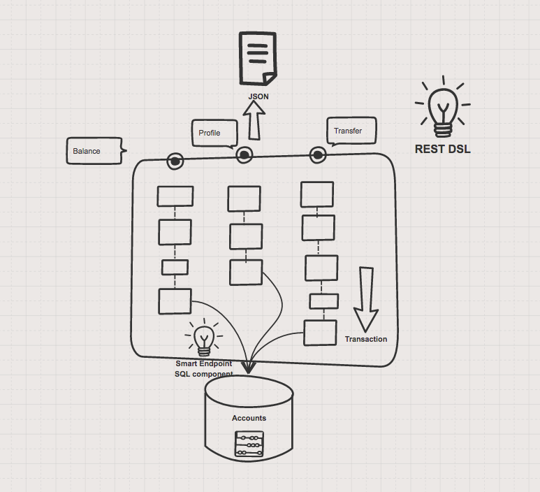

# FIS 2.0 - Traditional Banking

This demo demonstrates how to use SQL via JDBC along with Camel's REST DSL to expose a RESTful API.

This example relies on the [Fabric8 Maven plugin](https://maven.fabric8.io) for its build configuration 
and uses the FIS Java base image

## Background
This is a microservice that connects to a table in MySQL database, that provide 3 different functionality through APIs

1. Balance
    By providing the account id, it will retreive the remaining balance from the table and returns the result as Text. 
2. Profile
    By providing the account id, 
3. Transfer
    By providing the sender id, receiver id and also the amount to transfer, it will update the balance of both the sender and receiver on the remaining balance respectively. Transaction is needed this time, in case if there are any problem when updating the tables. 
    


Account Table 
```
| ID     | ACCTNAME | BALANCE | SSN       | PHONE      | ADDR                        | STATE  |
| ------ | -------- | -------:| --------- | ---------- | ----------------------------| ------ |
| 223455 | Chris L  |   $1600 | 749980000 | 6364858533 | 4 BLACK DEER ST, STONE      | TX     |
| 123456 | Simon C  |   $5000 | 987655663 | 7264947276 | 43 SLIVER EAGLE ST, RIVER   | MA     |
| 234567 | Amber K  |    $700 | 424676543 | 4274558382 | 67 RED LION ST, ROCK        | NY     |
| 345678 | Kelly J  |   $4400 | 987676543 | 3530880835 | 8 GREEN SHARK ST, MOUNTAIN  | CA     |
```

### Running the example locally

The example can be run locally using the following Maven goal:

    $ mvn spring-boot:run

This uses an embedded in-memory HSQLDB database. You can use the default Spring Boot profile in case you have a MySQL server available for you to test.

You can then access the REST API directly from your Web browser, e.g.:

- <http://localhost:8080/demos/account/profile/223455>
- <http://localhost:8080/demos/account/transfer/123456/15/223455>

### Running the example in OpenShift

Follow the README.MD file from the root README file.

### Swagger API

The example provides API documentation of the service using Swagger using the _context-path_ `demos/api-doc`. You can access the API documentation from your Web browser at <http://localhost:8080/demos/api-doc>.
