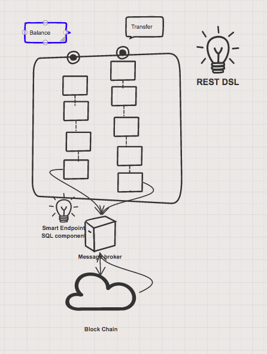

# FIS Demo - Block Chain Gateway

This demo demonstrates how to connect a Spring-Boot application to an ActiveMQ broker and use JMS messaging between two Camel routes using OpenShift.

In this example we will use two containers, one container to run as a ActiveMQ broker, and another as a client to the broker, where the Camel routes is running.

## Backgorund 
This demo is a MOCK bitcoin gateway connector, which exposes 2 API endpoints, one to check the balance and one does the transfer. These content is later sent to a messaging broker, and then picked up by a bean, which simply returns result of the transfer. 

1. Balance
    By providing the account id, it will retreive the remaining balance from the table and returns the result as Text. Error handling is implemented if no user can be found. 
2. Transfer
    By providing the sender id, receiver id and also the amount to transfer, it will update the balance of both the sender and receiver on the remaining balance respectively. 

### Running the example locally

The example can be run locally using the following Maven goal:

    mvn spring-boot:run

### More details

You can find more details about running this [quickstart](http://fabric8.io/guide/quickstarts/running.html) on the website. This also includes instructions how to change the Docker image user and registry.

